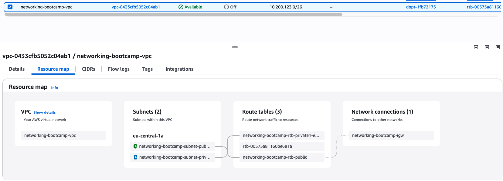

# AWS networking resources

## Create VPC

I followed along the video instruction to create a VPC through the AWS console. Usually I create it through IaC but wanted to see how the console developed over the years.

I also noticed an option of "Preview code" in AWS, this basically generates CLI commands for the actions that are performed in the console (including forms which are filled out but not applied). I decided to try it out like that and create the VPC through the script which contains the commands from the console.

It did require doing some search and replace, as some of the values were "preview" instead of the actual VPC name.

To create the VPC I ran:

```
cd aws
./01_create_vpc.sh 2>&1 | tee logs/01_create_vpc.log
```

The script required quite a lot of work to get it to run properly:
- The tag definitions were not capitalized properly, e.g. `tag` instead of `Tag`, `key` instead of `Key`, etc.
- The VPC name was used instead of the VPC ID. Same for subnet, route table, internet gateway, etc.

The fixed script worked and it created the VPC, subnets, etc, as expected:



For the record, the original script from the AWS console is `EXAMPLE_aws_generated_create_vpc.sh`.
